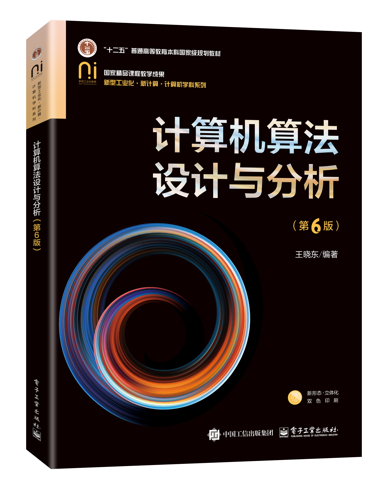

# 计算机算法设计与分析 (第6版)

This is the code repository for  [The Design and Analysis of Computer Algorithms 6th Edition](https://www.phei.com.cn/module/goods/wssd_content.jsp?bookid=52699), published by Publishing House of Electronics Industry.

## What is this book about?

This book covers the following exciting features:

★ Systematic: 

Explain the theoretical basis, implementation, and specific application techniques of algorithms from three aspects: theory,abstraction,and design. While discussing the core knowledge of algorithms, stimulate and enhance readers' computational thinking abilities. Using algorithm design strategies as the knowledge unit, systematically introduce the design methods and analysis techniques of computer algorithms, providing a broad and solid foundation of computer algorithm knowledge for computer and programming enthusiasts.

- Chapter 1 Algorithm Overviewr
- Chapter 2 Divide-and-Conquer Algorithms
- Chapter 3: Dynamic Programming
- Chapter 4 Greedy Algorithms
- Chapter 5 Backtracking Algorithms
- Chapter 6: Branch and Bound Algorithms
- Chapter 7 Randomized Algorithms
- Chapter 8 Linear Programming and Network Flow
- Chapter 9: Algorithms for Strings and Sequences
- Chapter 10: Algorithmic Number Theory

★ Popularity: 

The knowledge and application of computer algorithms have a wide range of disciplines, strong inclusiveness, and huge demand space for application, and have become one of the most important core competencies recognized internationally. The content presented in this book covers the foundation of human computer algorithm knowledge and has become the core content for assessing the level and skills of IT professionals in many industries.

★ Understandability: 

Use easy to understand language and concise examples to explain the theoretical basis, basic concepts, relevant mathematical knowledge, and general algorithms used in program design to solve practical problems of computer algorithms.

★ Practicality: 

Based on the theoretical foundation of computer algorithm knowledge, this article elaborates on a series of classic algorithms that are widely used in practice, and combines examples to introduce the implementation and application techniques of algorithms in program design using C++language, so that readers can comprehensively grasp the core knowledge and application technology of computer algorithms from both theoretical and practical levels.

## Anticipated new contributions

★ Comprehensive online teaching platform

★ New online automatic judge

★ All open-source  code

★ Complete online problem library

